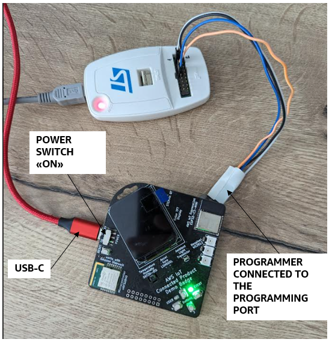
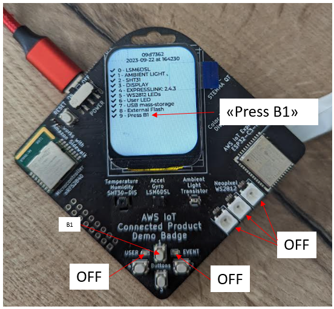
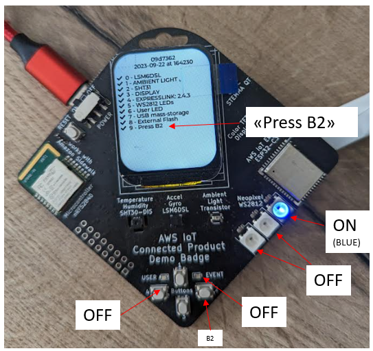
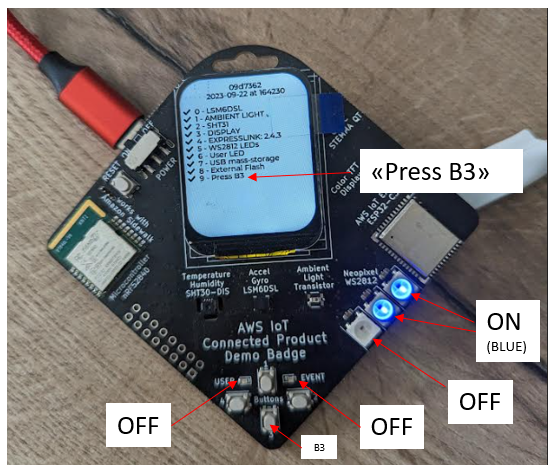
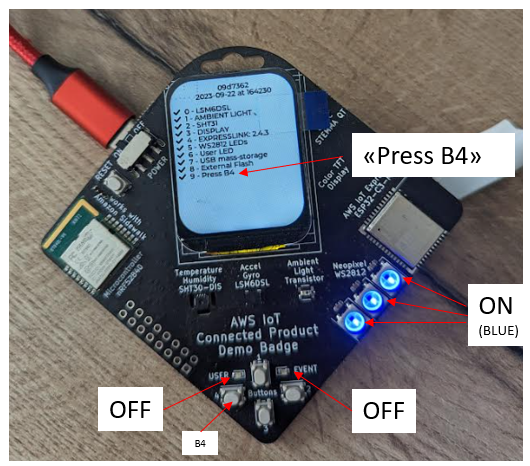
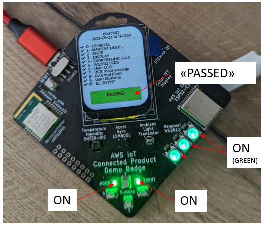

# AWS IoT - Connected Product - Demo Badge 2023

This document will guide you through the steps to:
- flash the Demo Badge device with a self-test FW
- run the self-test FW to perform a functional test of the device

## Setup
- programming tool:
  - linux or windows machine
  - OpenOCD v0.12.0
  - a nrf52 programmer supported by OpenOCD
- the "demobadge-xxx.zip" archive
- device:
  - programmer connected to the programming port
  - USB-C cable connected to the port
  - POWER switch in the ON position



## STEP1. unzip the self-test FW package
Copy the demobadge-xxx.zip archive to the linux/windows machine and unzip it.

On a linux machine:

```bash
unzip demobadge-xxx.zip
```

Make sure the following files has been extracted to folder "./demobadge-xxx"
./flash.cfg
./build/self_test_firmware_20230922.hex

## STEP2. flash the self-test FW
Flash the "self_test_firmware_20230922.hex" to the device.

On a linux machine:

```bash
cd ./demobadge-xxx/
openocd -f flash.cfg
```

If the programming was successful, OpenOCD's output should look like:


## STEP3. run the tests
The device is now programmed with the self-test FW.

### TEST 1
- ACTION:
  - make sure the device is powered on through the USB-C cable
  - make sure the POWER SWITCH is in the ON position
- SUCCESS CRITERIA:
  - all LEDs are OFF
  - display shows "Press B1"
  - display and LEDs must look like this:



In case the LEDs or the display do not behave as described, press the RESET button and try TEST1 again.

If it does not work, power-cycle the device:
- move the POWER switch to the OFF position
- wait 1s
- move the POWER switch to the ON position
- try TEST1 again

If it fails, discard the device.
Otherwise move to next test.

### TEST 2
- ACTION:
  - do press user button 1
- SUCCESS CRITERIA:
  - strip LED 1 turns on to BLUE
  - display shows "Press B2"
  - display and LEDs must look like this:



If it fails, discard the device.
Otherwise move to next test.

### TEST 3
- ACTION:
  - do press user button 2
- SUCCESS CRITERIA:
  - strip LED 1 and 2 turn on to BLUE
  - display shows "Press B3"
  - display and LEDs must look like this:



If it fails, discard the device.
Otherwise move to next test.

### TEST 4
- ACTION:
  - do press user button 3
- SUCCESS CRITERIA:
  - strip LED 1, 2, and 3 turn on to BLUE
  - display shows "Press B4"
  - display and LEDs must look like this:



If it fails, discard the device.
Otherwise move to next test.

### TEST 5

- ACTION:
  - press user button 4
- SUCCESS CRITERIA:
  - display shows "PASSED"
  - ALL the LEDs (3xStrip, 1xUSER and 1xEVENT LEDs) are ON and GREEN
  - display and LEDs must look like this:



If it fails, discard the device.
Otherwise the self-test has PASSED.
